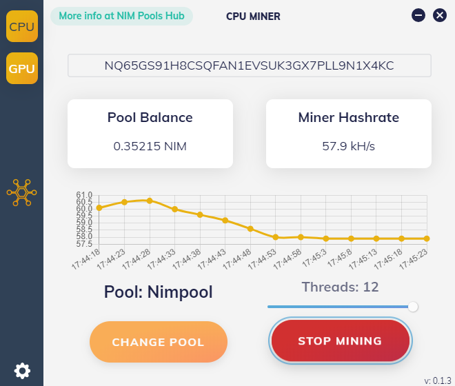
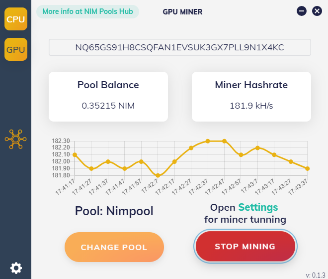

# NIM Pools Hub Miner

  

Nimiq Miner with focus on user experience and easy of use.

### Features:
- You can mine using **GPU** and **CPU** with the same miner
- Available for **NVIDIA** and **AMD** cards
- Works on any OS. Windows, Linux and macOS
- **Free**, no dev fee
- All active pools available
- Ready to start mining, no need to tweak any config
- Advance statistics for all pools in [one place](https://hub.shortnim.me/)

> GUI by Albermonte, Miner by SushiPool & Mat (tomkha)

## Download lastest version from Releases Page:

### [⛏️ Download NIM Pools Hub Miner ⛏️](https://github.com/Albermonte/nim-pools-hub-miner/releases/latest)

---

#### CPU & GPU Miner in action

  
