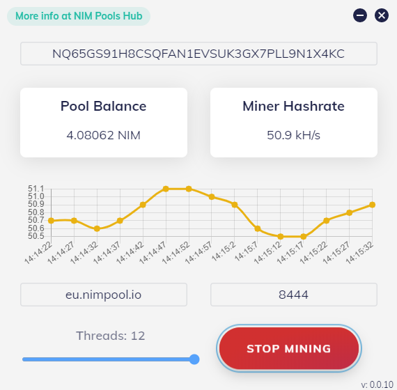
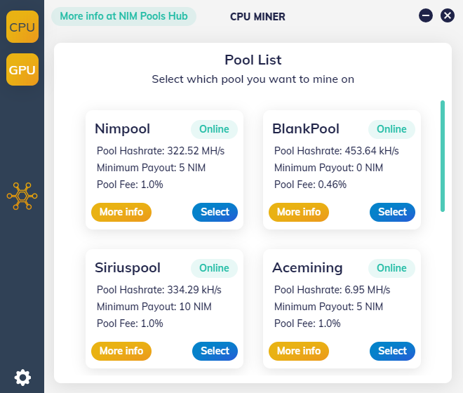

# NIM Pools Hub Miner []() [](https://wakatime.com/badge/github/Albermonte/nim-pools-hub-miner) [](https://ci.appveyor.com/project/Albermonte/nim-pools-hub-miner)

> GUI by Albermonte, Miner by SushiPool

## Download lastest release at:

[Release Page](https://github.com/Albermonte/nim-pools-hub-miner/releases/latest)

#### Miner in action

 

---

#### Build Setup

```bash
# install dependencies
npm install

# serve with hot reload at localhost:9080
npm run dev

# build electron application for production
npm run build


```

---

This project was generated with [electron-vue](https://github.com/SimulatedGREG/electron-vue)@[45a3e22](https://github.com/SimulatedGREG/electron-vue/tree/45a3e224e7bb8fc71909021ccfdcfec0f461f634) using [vue-cli](https://github.com/vuejs/vue-cli). Documentation about the original structure can be found [here](https://simulatedgreg.gitbooks.io/electron-vue/content/index.html).
